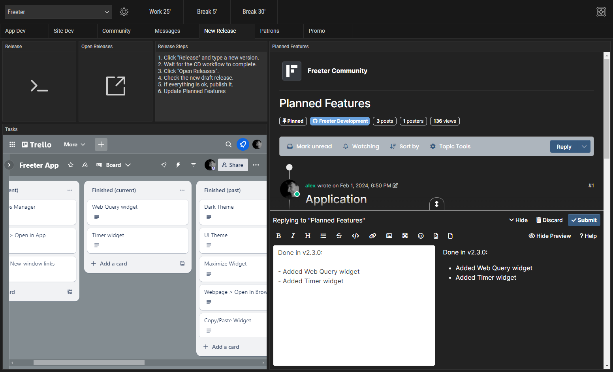

## The Problem: Too Many Tools, Too Many Tabs

Working on multiple projects often means endless **context switching**:

- Opening your code editor and digging for the right project files.
- Jumping into a client’s task manager to check tasks and deadlines.
- Searching across different websites for icons, design assets, or documentation.
- Logging into Gmail and Twitter DMs across several accounts.
- Running project-specific terminal commands for builds and deployments.

When everything is scattered, **productivity drops**. You waste time switching between tools instead of focusing on your actual work.

## The Solution: Organize Everything in One App

That’s where **Freeter** comes in. It’s a **free, open-source productivity tool** that lets you:

- Collect everything you need for each project in one place.
- Create **custom workflows** for development, messaging, releases, and more.
- Switch between projects instantly — without losing your flow.
- Reduce tab clutter and repetitive clicks.

Let’s break it down with three real examples of **Freeter workflows** that can **save you hours every week**.

## Workflow #1: App / Website Development

Imagine this: you open one workflow screen, and **everything you need** to start coding is right there:

- A task manager, embedded directly into the screen.
- One-click openers for your project files and mockups.
- Built-in search for MDN, Node.js docs, and your favorite icon websites.
- A notes widget for quick ideas.
- One-click links to your repo, bug reports, and feature requests.

You don’t waste time jumping around. You just **switch into “dev mode”** instantly.

## Workflow #2: Email & Twitter DMs

If you manage **multiple accounts**, you know the pain of logging in and out just to check messages.

With Freeter, you can:

- Embed Gmail and Twitter DMs directly into one workflow.
- Use **project-specific sessions**, so each workflow stays logged into the right account automatically.

No more hassle of switching accounts or browsers — just open your Messages workflow, and you’re ready to reply.

## Workflow #3: New App Release

Releasing a new version used to mean juggling multiple tools. Now, you can handle it in one place:

- **Release** → Execute build scripts directly from Freeter.
- **Open Releases** → Jump straight to the releases page in your browser.
- **Planned Features** → Update the Freeter community post with ease.
- **Tasks** → Review completed work without leaving your workflow.
- **Release Steps** → Follow a checklist so nothing gets overlooked.

Five widgets. One screen. Zero stress.

## Switch Between Workflows Like a Superhero

Now, instead of drowning in tabs, you press `Ctrl+Shift+F`, pick the workflow you need, and **instantly drop into the right context**.

No clutter. No friction. No wasted energy.

If you’ve been looking for a way to **organize your chaos and actually get more done**, Freeter can help you do exactly that.

It’s completely **free and open source**.

[Download Freeter](/download) and start organizing your workflows today.
