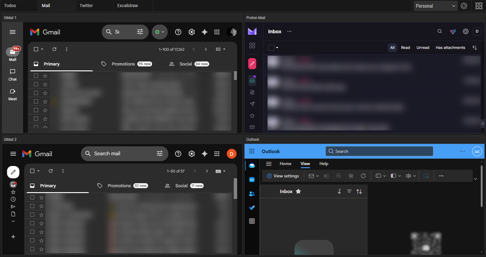
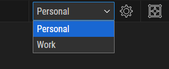
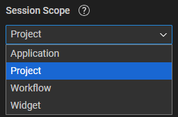

## Why Use Freeter to Manage Multiple Email Accounts?

Freeter isn’t just another email client. It’s a **workspace organizer** that lets you bring **all your web apps** — including Gmail, Outlook, iCloud, ProtonMail, and more — together into **one clean, organized interface**.

- **Add unlimited email accounts** — even multiple instances of the same provider
- Run Gmail and other most used web apps like a **native desktop app**
- Switch between personal and work emails instantly
- Organize everything into **projects and workflows** for maximum efficiency
- 100% **free** and **open-source** — no sign-ups, no hidden fees

With Freeter, managing multiple inboxes finally becomes effortless.

## All Your Email Apps in One Place

One of Freeter’s superpowers is its ability to handle **as many email accounts as you need** — even from the same provider.

Say you have:

- Two Gmail accounts (personal + work)
- One Outlook inbox
- One ProtonMail account

Instead of juggling four different browser tabs, you can keep **all your email accounts in a single workflow tab** inside Freeter.

Even better, Freeter runs Gmail (and other web apps) like a **desktop app** — perfect since Gmail doesn’t have an official desktop client. Open your inbox directly from Freeter and stay focused without tab overload.

## Stay Organized with Projects & Workflows

Freeter makes it easy to **organize your email accounts** the way you work.

- **Projects** help you group related workflows — for example, “Personal,” “Work,” or “Project A”, “Project B”, “Project C”, or “Client A”, “Client B”, “Client C”.
- **Workflows** let you separate accounts or providers inside each project.

Example setup:

- **Project 1: Personal** → 3 Gmail accounts + 1 Outlook
- **Project 2: Work** → 2 Gmail accounts + 4 Outlook + 1 ProtonMail

Switching between contexts is instant, and your inboxes stay neatly organized — no more mixing personal and professional emails.

## Sessions: No More Repeated Logins

Tired of logging in every time you switch email accounts? Freeter’s **Sessions** feature solves that.

Each web app instance can keep its own **separate login session**, so you stay signed in to multiple Gmail, Outlook, or iCloud accounts at once.

You control how sessions are stored using **Session Scopes**:

- **Widget** → Keep the account only for this app instance.
- **Workflow** → Share the same session within one workflow.
- **Project** → Share the session across all workflows within one project.
- **Application** → Share the session everywhere in Freeter.

Plus, with **Session Persistence**, you choose whether to stay signed in after closing Freeter — or automatically clear your sessions for privacy.

## How to Add Email Accounts to Freeter

Getting started takes just a few minutes:

1. [**Download Freeter**](/download) — it’s free and open-source.
2. Open **Manage Projects**, create a project, and click **OK**.
3. Enable **Edit Mode**.
4. Drag the **Webpage** widget into your workflow.
5. Open **Widget Settings**.
6. Paste your email provider’s URL from your web browser (e.g., Gmail, Outlook, ProtonMail).
7. If you need **multiple accounts** from the same provider, set **Session Scope → Widget**.
8. Click **OK**, then **Disable Edit Mode**.

Log in once, and you’re ready to manage your inbox directly from Freeter — no browser required.

## Why Freeter Beats Other Email Management Tools

Unlike most dedicated email apps, Freeter isn’t locked to one provider or one account. It’s a **universal workspace** — meaning you can:

- Combine Gmail, Outlook, ProtonMail, Yahoo, Apple Mail, and more.
- Use multiple logins per provider.
- Organize accounts however you like.
- Keep **all your web apps** — not just email — in one place.

And the best part? **Freeter is completely free and open-source**. No subscriptions. No sign-ups. Just download, set up your workspace, and take control of your inboxes.

## Take Control of Your Emails Today

Managing multiple email accounts doesn’t have to be stressful. With **Freeter**, you can bring **all your inboxes into one organized workspace**, save time, and finally get rid of tab chaos.

[Try Freeter today](/download) — it’s free, open-source, and built to make your workflow seamless.
