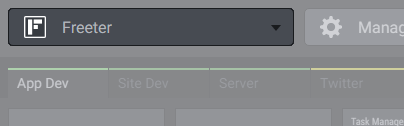
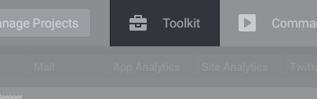

# Freeter Basics

When you open Freeter, it displays the main window. The window is made up of the following elements:

## 1. Project Switcher

Use Project Switch to move between your projects. [Read more about Projects...](../../using-freeter/projects)

## 2. Manage Projects Button

Press Manage Projects button to add, edit, delete projects. [Read more about Projects...](../../using-freeter/projects)

## 3. Dashboard Tabs Area

A project you are working on may consist of sub-projects or different routines, e.g. Site Development, Social Media Communications, Promotion, Analytics, and so on. Use Dashboard Tabs to add separate dashboards for each routine and navigate between them. [Read more about Dashboard Tabs...](../../using-freeter/dashboard-tabs)

## 4. Dashboard Area

Dashboard is the place where you access all your project-related things. You can customize dashboards the way you want by adding widgets to them. [Read more about Dashboard...](../../using-freeter/dashboard)

## 5. Timers Tab

Use Timers Tab to launch a timer. [Read more about Timers...](../../using-freeter/timers)

## 6. Toolkit Tab

Use Toolkit Tab to launch your tools. [Read more about Toolkit...](../../using-freeter/toolkit)

## 7. Commands Tab

Use Commands Tab to execute command-lines in the project directory. [Read more about Commands...](../../using-freeter/commands)

## 8. Webpages Tab

Use Webpages Tab to open common webpages you often need while working on various projects. [Read more about Webpages...](../../using-freeter/webpages)

## 9. Searches Tab

Use Searches Tab to easily perform searches on the web through your predefined search scopes. [Read more about Searches...](../../using-freeter/searches)

## 10. Edit Layout Button

Press Edit Layout Button to turn on/off the edit mode for adding, editing, moving and deleting the dashboard tabs and widgets.

