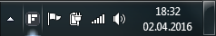
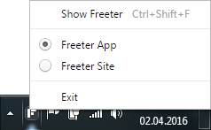

# Accessing Freeter

## Hotkey

The easiest way to access Freeter is to press Ctrl (or Cmd)+Shift+F hotkey. It will immediately bring up Freeter. If you press the hotkey when Freeter is focused, it will hide. This enables you to easily switch between your current window and Freeter.

> Note: If you have any conflicts with the usage of Ctrl (or Cmd)+Shift+F, you can attach Freeter to another hotkey via File > Settings menu.

## System Tray

Alternatively you can access Freeter by clicking the "F" icon on the system tray.

Or even open a specific project on Freeter by right-clicking the "F" icon and choosing the project.

