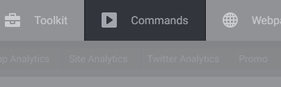

# Commands

Commands enable you to execute command lines in a project directory and copy files to/from a project directory with a single mouse click. Example scenarios when the commands will save your time:

- You have project templates, and you use them as a base for new projects by copying them to project directories.
- You always need to execute same command lines. For example, install dependencies by 'npm install' and 'bower install', build applications by 'gulp build', and so on.

Both the scenarios can be turned into Freeter commands executable by a simple mouse click.

## Adding, Updating, Deleting Commands

Use the Manage Commands menu to add / delete commands and edit their settings. It can be accessed via the Commands tab.

## Executing Commands

Commands can be executed using the Commands tab. Just move the cursor over the tab and click on a command you want to execute.
