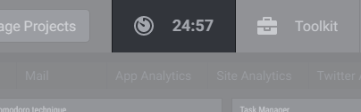

# Timers

Timer is a personal productivity tool helping you to get things done. It's a countdown clock that notifies you when time is up. Use it to allocate only a specific amount of time to an activity. Limiting your time motivates you to concentrate on that activity and stay focused.

## Adding, Updating, Deleting Timers

Use the Manage Timers menu to add / delete timers and edit their settings. The menu can be accessed via the Timers tab.

## Launching Timers

Timers can be launched using the Timers tab. Just move the cursor over the tab and click on a timer you want to launch.
