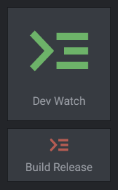
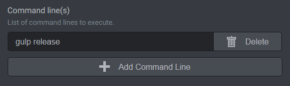
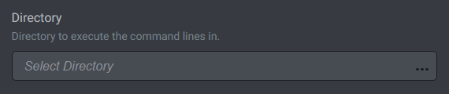

# Commander

Commander widget enables you to execute command-lines with a single click.

> Note: There is [Commands tab](../../using-freeter/commands) offering similar functionality. The difference is that the tab is for "generic" command lines that are not tied to a specific project, while the Commander widget is for a specific project only.

## Execute Single or Multiple Command Lines

Commander widget can execute a single command line or multiple command lines. Add as many command lines as you want.

## Execute Command Lines in Specific Directories

By default, when the directory setting is empty, the command lines are executed in the project directory (a directory specified on the project settings). If you need to execute the command lines in another directory, then select it using the directory picker.

