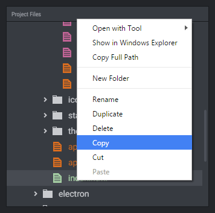

# File Explorer

File Explorer widget enables you to easily browse through a directory and open files.

## Browse Specific Directory

By default, when the directory setting is empty, the file explorer shows the contents of the project directory (a directory specified on the project settings). If you need to browse another directory, then select it using the directory picker.

## Highlighting Files and Directories

You can add rules to highlight files and directories based on their names and extensions. For example, filenames beginning with "mockup_" may trigger the red color and "html" extensions - green color.

## Editing Rules

To add, update and remove highlighting rules, use the Configure Widget menu.

## Changing Rules Priority

To change the priority of the rules, just drag & drop them on the Configure Widget menu. The rules are checked from top to bottom. The first one which matches is applied.

## Open Highlighted Files with Tool

File Explorer Widget can open highlighted files with a specific tool from your [Toolkit](../../using-freeter/toolkit), instead of a default one associated with a file type. Just select a tool on the rule settings.

## File Operations

Use the contextual menu (accessible via right-click on Win, or control-click on Mac) to perform file operations in the widget.

Available commands: Open with Tool, Show in Explorer / Finder, Copy Full Path, New Folder, Rename, Duplicate, Delete, Cut, Copy, Paste.

## Multi-select

To select multiple items use the shift and ctrl/cmd keys.
