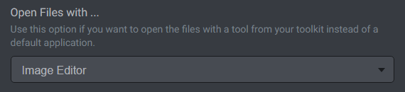

# File Opener

File Opener widget enables you to open files or directories with a single click.

## Open Single or Multiple Files/Folders

File Opener widget enables you to open a single file/folder or a whole group of files/folders. Add as many files/folders as you need.

## Open Files/Folders with Tool

File Opener widget can open files and folders with a specific tool from your [Toolkit](../../using-freeter/toolkit), instead of a default application associated with a file type. Just select a tool from the list.

