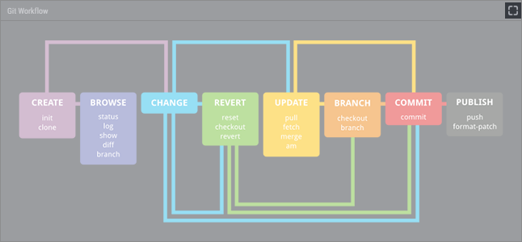

# Image

Image widget enables you to place an image on the dashboard. I.e. a wireframe, a cheat sheet, a mind map, a motivational picture, and so on.

## Setting Image

To set an image, just drag and drop it from your computer or a website. Or use the widget configuration menu.

## Adjusting Image Size

To adjust the image size, use the contextual menu (accessible via right-click on Win/Linux, or control-click on Mac). Or use the widget configuration menu.

## Expanding Widget to Full Window

Image widget have the full window mode. It enables you to easily navigate a large image. Just double-click on a widget title or click the Full Window button on the top right corner, to enter / leave the full window mode.

