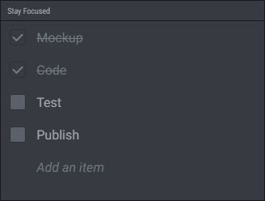
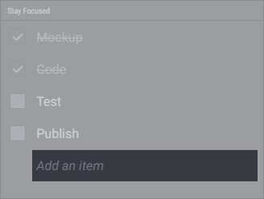
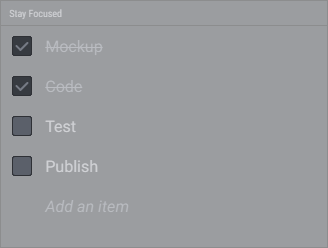
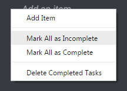
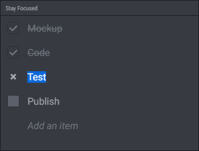
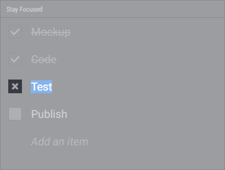
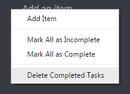

# To-Do List

Use the to-do list widget to quickly organize your tasks.

## Adding Task

To add a task, just write it into the "Add an item" area and press Enter. The area keeps focused so you can easily add as many tasks as you want.

## Marking Tasks as Complete / Incomplete

Click on a checkbox to mark the task as complete or incomplete.

## Marking All Tasks as Complete / Incomplete

Open the contextual menu and select "Mark All as Complete / Incomplete". This might be helpful if you want to use the to-do list widget as a checklist.

## Moving Task

To move a task on the list, just drag it to a new position.

## Moving Completed Tasks to Bottom

By default, when you mark a task as complete, it automatically moves to the bottom of the list. If you want to disable this feature, uncheck it on the widget settings.

## Editing Task

Click on the task's text to edit it.

## Removing Task

When you're editing a task, click the delete button to remove it from the list.

## Removing Completed Task

Open the contextual menu and select "Delete Completed Tasks".

