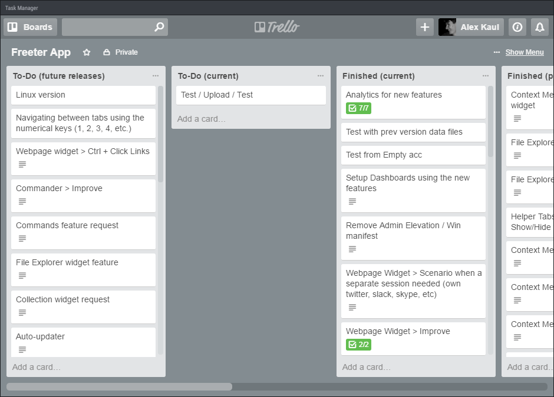
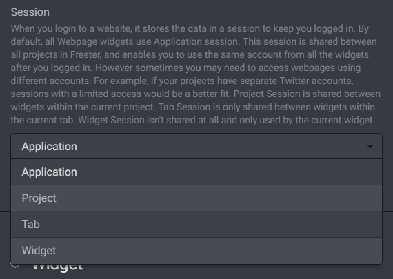
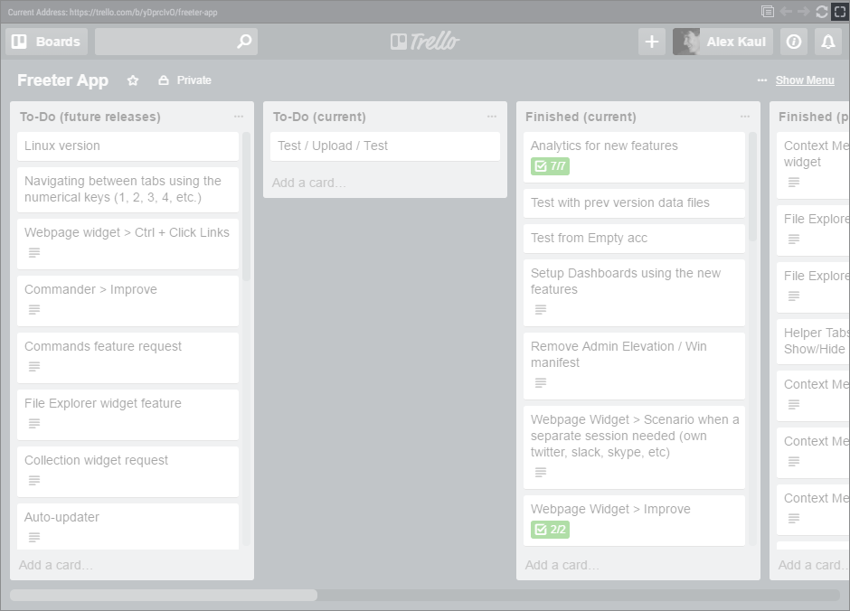

# Webpage

Often need to open web apps, such as a task manager, a social media account, analytics, messenger, and so on? Webpage widget enables you to easily access them directly from the dashboard.

## Show Mobile Version

If a web app or a website has a mobile version, then you can use Show Mobile Version option to show it instead of a desktop one. This is useful when you have multiple widgets on a dashboard and want webpages to fit a smaller area.

## Session

When you login to a website, it stores the data in a session to keep you logged in. By default, all Webpage widgets use Application session. This session is shared between all projects in Freeter, and enables you to use the same account from all the widgets after you logged in. However sometimes you may need to access webpages using different accounts. For example, if your projects have separate Twitter accounts, sessions with a limited access would be a better fit. Session option specifies how the session data is shared across Freeter.

Project Session is shared between widgets within the current project. Tab Session is only shared between widgets within the current tab. Widget Session isn't shared at all and only used by the current widget.

## Auto Reload

If you need to continually refresh a webpage, use Auto Reload feature to set the refresh interval.

## Expanding Widget to Full Window

Webpage widget have the full window mode. It enables you to easily navigate through content that doesn't fit a widget area. Just double-click on a widget title or click the Full Screen button on the top right corner, to enter / leave the full window mode.

