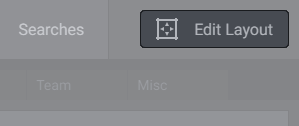

# Dashboard Tabs

A project you are working on may consist of sub-projects or different routines, e.g. Site Development, Social Media Communications, Promotion, Analytics, and so on. Use Dashboard Tabs to add separate dashboards for each routine and navigate between them.

## Turning On Edit Layout Mode

Use Edit Layout mode to edit the dashboard tabs. Press the Edit Layout button to turn on Edit Layout mode.

## Adding Tabs

When you are in the Edit Layout mode, push the Add Tab button on the tabs area (goes after the tabs).

## Moving Tabs

To move a tab, click on it and drag to a new place.

## Copying and Pasting Tabs

To copy a tab, call its contextual menu (see below) and select the Copy Tab item. Then open a project you want to paste the tab to, call the contextual menu of the tabs area and use the Paste Tab menu to add a duplicate of the copied tab.

> Tip: The Paste Tab menu stores up to 10 recently copied tabs. This feature enables you to copy multiple tabs from one or multiple projects at once and then paste to another one with no hassle.

## Renaming Tabs

To rename a tab, just double-click on it.

## Configuring Tabs

To configure a tab, move the cursor over it and click the Configure Tab button on the right side.

## Removing Tabs

To delete a tab, move the cursor over it and click the Delete Tab button on the right side.

## Contextual Menu

You can use the contextual menu (accessible via right-click on Win, or control-click on Mac) to perform the following commands:
rename, configure, delete, copy, paste.

## Turning Off Edit Layout Mode

When you have finished editing the dashboard tabs, press the Finish Editing button to turn off Edit Layout mode.

