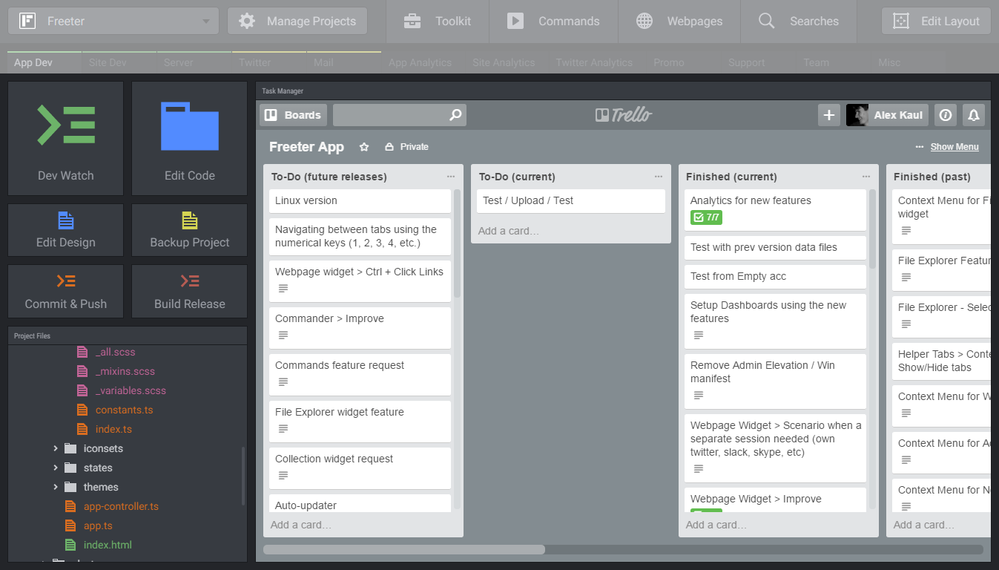
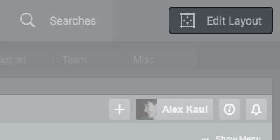
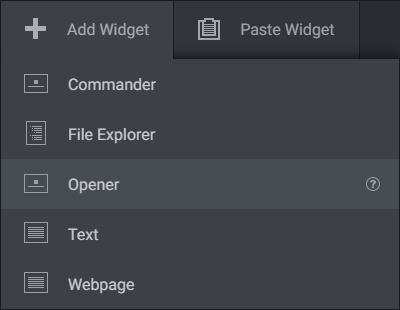
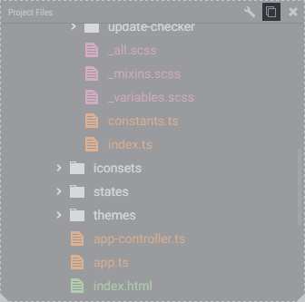
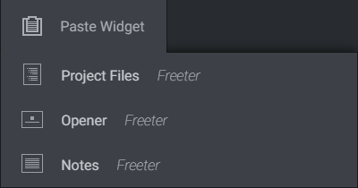
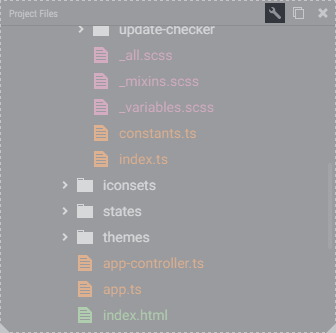
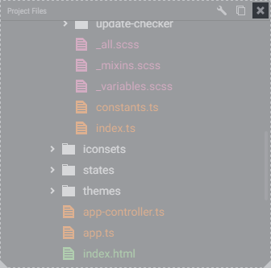
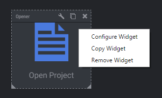
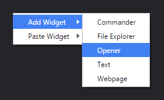
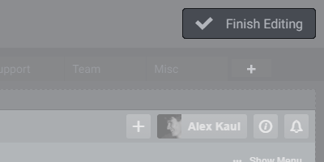

# Dashboard

Dashboard is the place where you access all your project-related things. You can customize dashboards the way you want by adding widgets to them.

## Turning On Edit Layout Mode

Use Edit Layout mode to edit the dashboard and widgets. Press the Edit Layout button to turn on Edit Layout mode.

## Adding Widgets

When you are in the Edit Layout mode, use Add Widget menu at the header bar to add new widgets. Drag a widget and drop it on the dashboard, or just click on it.

## Moving and Resizing Widgets

To move a widget, click on it and drag to a new place. To resize a widget, use its edges and corners.

## Copying and Pasting Widgets

To copy a widget, move the cursor over it and click the Copy Widget button on the top right corner. Then open a dashboard you want to paste the widget to, and use the Paste Widget tab to drop a duplicate of the widget.

> Tip: The Paste Widget tab stores up to 10 recently copied widgets. This feature enables you to copy multiple widgets from one or multiple dashboards and then paste to another one with no hassle.

## Configuring Widgets

To configure a widget, move the cursor over it and click the Configure Widget button on the top right corner.

## Removing Widgets

To delete a widget, move the cursor over it and click the Remove Widget button on the top right corner.

## Contextual Menu

Alternatively, you can use the contextual menus (accessible via right-click on Win, or control-click on Mac) to perform the above-mentioned commands.

Use Widget's menu to copy, configure and remove widgets.

Use Dashboard's menu (called via the free dashboard space) to add and paste widgets.

## Turning Off Edit Layout Mode

When you have finished editing the layout and widgets, press the Finish Editing button to turn off Edit Layout mode.

