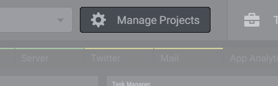
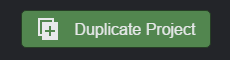
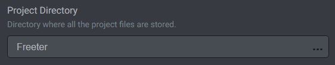
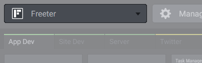

# Projects

Projects are base units in Freeter. They represent projects you are working on, be it a website you are designing, a mobile application you are developing, a set of articles you are writing, etc.

Each time you start working on a project, add it to Freeter first. That should become a part of your workflow in order to improve your productivity in a long run.

## Adding, Updating, Deleting Projects

Use the Manage Projects menu to add / delete projects and edit their settings.

## Duplicating Projects

Use the Duplicate Project button on the Manage Projects menu to add a full copy of a selected project (including its settings, dashboards and widgets).

## Project Directory

Use the project directory setting to specify the root directory where the project files are stored. This setting is used by different Freeter components. For example, you can execute command lines in the project directory or copy files to/from the project directory with a single click.

## Switching between Projects

To switch from one project to another, use the project switcher on the main screen.

