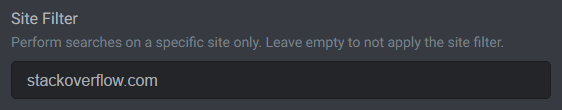
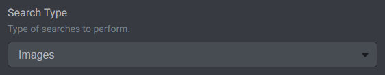

# Searches

Searches enable you to easily find things on the web through predefined search scopes. This frees you from typing repetitive parts of search queries. For example, you may add a search scope for "Photoshop How-Tos". When you type "outline text" to it, Google auto-opens and performs a search for "How to outline text in Photoshop". Or you may add a search scope for "Stackoverflow" that will add "site:stackoverflow.com" to your queries and perform a search on that site only.

## Adding, Updating, Deleting Search Scopes

Use the Manage Search Scopes menu to add / delete search scopes and edit their settings. It can be accessed via the Searches tab.

## Query Template

Use the Query Template option to set a template for generating search queries. The template is just a regular text line with %QUERY% placeholder in it. When you type a query on the Searches tab, the %QUERY% will be replaced with it and the resulting search query will be executed. For example, if you use "How to %QUERY% in Photoshop" template, and type "outline text" on the Searches tab, then this will perform the "How to outline text in Photoshop" search.

## Site Filter

Use the Site Filter option to perform searches on a specific site only.

> Tip: If you are using Google as a search engine, then you can specify a url to narrow the searches (e.g. stackoverflow.com/questions/tagged/javascript). Bing supports domains only.

## Images Type

Also you can set the Images type to perform searches through images.

## Performing Searches

Searches can be performed using the Searches tab. Just move the cursor over the tab, click on a scope you want to search through and type your query.
