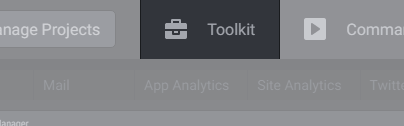

# Toolkit

Toolkit is a set of desktop applications you use while working on your projects. It enables you to group all the tools in one place, and launch them from Freeter. Also there are other Freeter features that depend on the toolkit. For example, you can use a tool from the toolkit in the opener widget to open project files with it.

## Adding, Updating, Deleting Tools

Use the Manage Tools menu to add / delete tools and edit their settings. The menu can be accessed via the Toolkit tab.

## Launching Tools

Tools can be launched using the Toolkit tab. Just move the cursor over the tab and click on a tool you want to launch.
