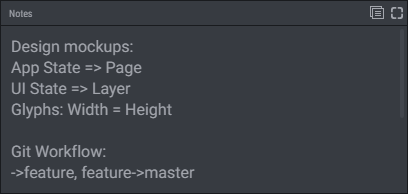
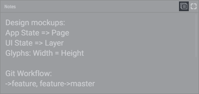
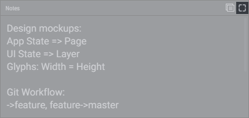

# Text

Having to retype same messages or information again and again? Use Text widget to place them on a dashboard, and copy-paste the snippets with a mouse click.

Also you can use Text widget to store quick notes related to your project. You may put there your thoughts, ideas or any other things you need to remember and easily access.

## Copying Text Snippet

To quickly copy the text snippet, click Copy Full Text button on the top right corner of Text widget. Also you can Copy Full Text via the contextual menu (right-click on Win, or control-click on Mac).

## Expanding Widget to Full Window

Text widget have the full window mode. It enables you to easily navigate through content that doesn't fit a widget area. Just double-click on a widget title or click the Full Screen button on the top right corner, to enter / leave the full window mode.

